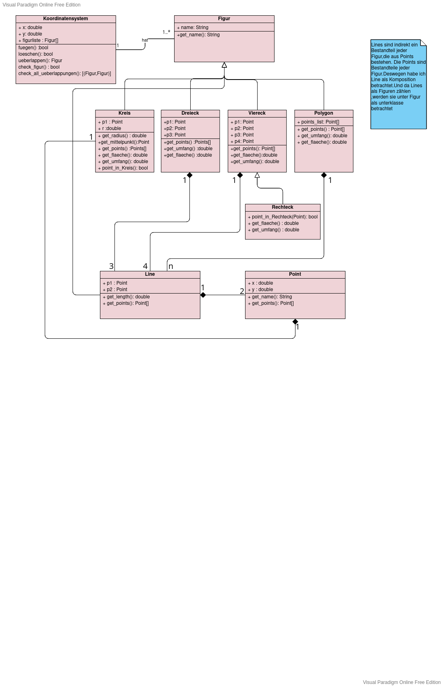

# Koordinatensystem
Einführung
------------

Das Projekt bietet die Möglichkeit, Koordinatensysteme mit beliebig großen Ordinaten- und Abszisse-werten und eine Liste von geometrischen Objekten innerhalb des Koordinatensystems
zu erstellen, geometrische Figuren in dem
Koordinatensystem zu platzieren und zu erkennen, ob diese sich überlappen. 
Man kann dem Koordinatensystem beliebig viele Geometrische Figuren(einzeln) hinzufügen bzw. aus dem Koordinatensystem löschen(falls sie vorhanden sind).
## Anforderungen
Bei dem Einfügen"fuegen(figur)" wird automatisch Überprüft,ob die Koordinaten der einzufügenden Figur ins Koordinatensystem hineinpassen. 
Beim Löschen''loeschen(figur)'' wird auch eine automatische Überprüfung, ob die zulöschende Figur im Koordinatensystem vorhanden ist. 
man kann jederzeit mithilfe einer Funktion ''check_all_uberlappungen()'' die Überlappungen der Figuren(Kreisen und Rechtecken) erkennen
### Details
Es wird eine Oberklasse **Figur** mit dem Attribute ''name'' für die allgemeine Darstellung aller geometrischen Figuren  implementiert.Jede andere Klasse im Skript Figur.py wird von "Figur" vererbt und stellt eine bestimmte Figur dar.Die UnterKlassen sind:**Point**,**Line**,**Dreieck**,**Vierecke** und deren Unterklasse **Rechteck**,**Kreis** und **Polygon**. 
In jeder einzelnen Klasse werden je nach Bedarf zusätzliche Attribute und hilfmethoden implementiert, um die Fläche mit ''get_flaeche()'' bzw. den Umfang mit ''get_umfang()''der jeweiligen Figur zu berechnen als auch deren Platz mit ''get_points()''zu finden.
### Tests Ausführen
Um einen Überblick zu erhalten,kann man den Skript ''tests.py'' ausführen und die Ergebnisse auf der Konsole anschauen.
## Klassen-Diagramm
im unteren Bild ist das Klassendiagramm zum Projekt: 

